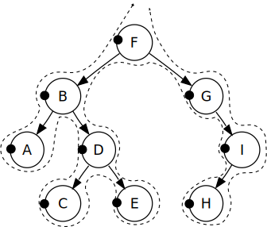

# 数据结构

## 数据结构入门

### 数据结构基础知识

1. **数据**是对客观事物的符号表示。

2. **数据元素**是数据的基本单位，也称节点或记录。

3. **数据项**是数据的不分割的最小单位。

4. **数据对象**是性质相同的数据元素的集合，是数据的一个子集。

5. **数据结构**是相互之间存在一种或多种特定关系的数据元素的集合。

6. 数据元素相互之间的关系称为**结构**。

7. **逻辑结构**是数据元素间抽象化的逻辑关系，它是从具体问题中抽象出来的数学模型。

8. 四类基本**逻辑结构**：

   - **集合**
   - **线性结构**
   - **树形结构**
   - **图状结构**或**网状结构**

9. 数据结构在计算机中的表示称为数据的**存储结构**。

10. 两种不同的存储结构：**顺式存储结构**和**链式存储结构**。

11. **数据类型**是一个<u>**值的集合**</u>和定义在这个值集上的<u>**一组操作**</u>的总称。

12. 高级程序语言中的数据类型可分为两类：

    - 非结构的**原子类型**
    - **结构类型**

13. **抽象数据类型（ADT）**是指一个数学模型以及定义在该模型上的一组操作。

14. 一个含抽象数据类型的软件模块通常应该包括定义、表现和实现三部分。

15. 抽象数据类型按其值的不同特性，可细分为下列三种类型：

    - **原子类型**属原子类型的变量的值是不可分解的。
    - **固定聚合类型**是该类型的变量，其值由确定数目的成分按某种结构组成。
    - **可变聚合类型**和固定聚合类型相比较，构成可变聚合类型“值”的成分的数目不确定。

16. 抽象数据类型可用**（D,S,P）**三元组表示，其中，D是数据对象，S是D上的关系集，P是对D的基本操作集。

17. 抽象数据类型定义：

    ```c
    ADT 抽象数据类型名{
    数据对象：<数据对象的定义>
    数据关系：<数据关系的定义>
    基本操作：<基本操作的定义>
    } ADT 抽象数据类型名;
    ```

18. 算法是对特定问题求解步骤的一种描述，此外，一个算法还具有下列5个重要特性：

    - **有穷性**
    - **确定性**
    - **可行性**
    - **输入**
    - **输出**

19. 算法设计的要求：

    - **正确性**
    - **可读性**
    - **健壮性**
    - **效率与低存储量要求**

### 算法效率的度量

1. 时间复杂度
2. 空间复杂度

## 线性表

### 顺序表

#### 顺序表的静态分配

静态分配采用定长数组进行分配，但可能会出现溢出问题。

```c
#define MAXSIZE 100
typedef struct{
    int data[MAXSIZE];	//以整型为例，实际采用ElemType，使用时只需在文件头typedef int ElemType;
    int length;			//length记录元素个数
}SqList;				//使用typedef简化类型声明，如定义一个顺序表只需SqList L；
```

#### 顺序表的动态分配

动态分配采用指针，以```elem```作为空间的基地址（首地址），```length```记录元素个数（顺序表长度）。

```c
#define MAXSIZE 100
#define LISTINCREMENT 10 
//存储空间分配增量
typedef struct{
    ElemType *elem;
    int length;			//length记录元素个数
	int listsize;       //当前分配的存储容量（以sizeof(Elemtype)为单位）
}SqList;
```

#### 顺序表的基本操作

以动态分配为例，分别用C语言写出顺序表的初始化、创建、取值、查找、插入、删除等基本操作。

##### 获得元素

```c
#define OK 1
#define ERROR 0
#define TRUE 1
#define FALSE 1
typedef int Status;
/* Status是函数的类型，其值是函数结果状态代码 */
```

```c
/* 初始条件：顺序线性表L已存在，1 ≤ i ≤ ListLength(L) */
/* 操作结果：用e返回L中第i个数据元素的值 */
Status GetElem(SqList L,int i,ElemType *e){
    if(L.length == 0 || i<1 || i>L.length)
        return ERROR;
    *e = L.data[i-1];
    return OK;
}
```

##### 初始化

```c
Status InitList(SQList &L){
	//构造一个空的线性表L
	L.elem = (ElemType * )malloc(MAXSIZE * sizeof(ElemType));
	if(!L.elem) exit(OVERFLOW);    //存储空间分配失败
	L.length = 0;    空表长度为0
	L.listsize = MAXSIZE;    //初始存储容量
	return OK;
}
```

##### 查找

```c
int LocateElem(SqList L, ElemType e,
              Status(* compare)(ElemType, Elemtype)){
    //在顺序线性表L中查找第一个值与e满足compare()的位序
    // 若找到，则返回其在L中的位序，否则返回0
    i = 1;		//i的初值为第一个元素的位序
    p = L.elem;	//p的初值为第一个元素的存储位置
    while (i<=L.length && !(*compare)(*p++,e)) 
        ++i;
    if(i<=L.length)
        return i;
    else return 0;
}
```

##### 插入

插入算法的思路：

- 如果插入位置不合理，抛出异常；
- 如果线性表长度大于数组长度，抛出异常或动态增加容量；
- 从最后一个元素开始向前遍历到第i个位置，分别将它们都向后移动一个位置；
- 将要插入元素填入i处；
- 表长加1。

```c
/* 初始条件：顺序线性表L已存在，1 ≤ i ≤ ListLength(L) */
/* 操作结果：在L中第i个位置之前插入新的数据元素e，L的长度加1 */
Status ListInsert(SqList *L,int i,ElemType e){
    int k;
    if(L->length == MAXSIZE) /*顺序线性表已满*/
        return ERROR;
    if (i<1 || i>L->length+1) /*当i不在范围内时*/
        return ERROR;
    if (i <= L->length)	/*若插入数据位置不在表尾*/
    {
        for (k=L->length-1;k>=i-1;k--)
            /*将要插入位置后数据元素向后移动一位*/
            L->data[k+1] = L->data[k];
    }
    L->data[i-1] = e; /*将新元素插入*/
    L->length++;
    return OK;    
}
```

##### 删除

删除算法的思路：

- 如果删除位置不合理，抛出异常；
- 取出删除元素；
- 从删除元素位置开始遍历到最后一个元素位置，分别将它们都向前移动一个位置；
- 表长减1。

```c
/* 初始条件：顺序线性表L已存在，1 ≤ i ≤ ListLength(L) */
/* 操作结果：删除L的第i个数据元素，并用e返回其值，L的长度减1 */
Status ListDelete(SqList *L,int i,ElemType *e){
    int k;
    if (L->length == 0)		/*线性表为空*/
        return ERROR;
    if(i<1 || i>L->length)	/*删除位置不正确*/
        return ERROR;
    *e = L->data[i-1];
    if (i < L->length)
    {
        for(k=i;k < L->length;k++)
            L->data[k-1] = L->data[k];
    }
    L->length--;
    return OK;
}
```

#### 线性表顺序存储结构的优缺点

| 优点                                                 | 缺点                                           |
| :--------------------------------------------------- | :--------------------------------------------- |
| 无需为表示表中元素之间的逻辑关系而增加额外的存储空间 | 插入和删除操作需要移动大量元素                 |
| 可以快速的存取表中任一位置的元素                     | 当线性表长度变化较大时，难以确定存储空间的容量 |
|                                                      | 造成存储空间的碎片化                           |

### 线性表的链式存储结构

#### 头指针与头结点的异同

| 头指针                                                       | 头结点                                                       |
| ------------------------------------------------------------ | ------------------------------------------------------------ |
| 头指针是指链表指向第一个结点的指针，若链表有头结点，则是指向头结点的指针 | 头结点是为了操作的统一和方便而设立的，放在第一元素的结点之前，其数据域一般无意义（也可存放链表的长度） |
| 头指针具有标识作用，所以常常用头指针冠以链表的名字           | 有了头结点，对在第一元素结点前插入结点和删除第一结点，其操作与其他结点操作相同 |
| 无论链表是否为空，头指针均不为空。头指针是链表的必要元素     | 头结点不一定是链表必须要素                                   |

#### 线性表的单链表存储结构

```c
typedef struct Node{
    ElemType data;
    struct Node *next;    
}Node;
typedef struct Node *LinkList;	/*定义LinkList;*/
```

假设p是指向线性表第i个元素的指针，则该结点a~i~的数据域可以用`p->data`表示，`p->data`的值是一个数据元素，结点a~i~的指针域可以用`p->next`来表示，`p->next`的值是一个指针。`p->next`是指向a~i+1~的指针。也就是说，如果`p->data`=a~i~，那么`p->next->data`=a~i+1~。

#### 单链表的读取

获得链表第i个数据的算法思路：

1. 声明一个结点p指向链表第一个结点，初始化j从1开始；
2. 当j<i时，就遍历链表，让p的指针向后移动，不断指向下一结点，j累加1；
3. 若到链表末尾p为空，则说明第i个元素不存在；
4. 否则查找成功，返回结点p的数据。

```c
/* 初始条件：顺序线性表L已存在，1≤i≤ListLength(L) */
/* 操作结果：用e返回L中第i个数据元素的值 */
Status GetElem(LinkList L,int i,ElemType *e)
{
    int j;
    LinkList p;		//声明一结点p
    p = L->next;	//让p指向链表L的第一个结点
    j = 1;			//j为计数器
    while(p && j<i)	//当p不为空或者计数器j还没有等于i时，循环继续
    {
        p = p->next;	//让p指向下一个结点
        ++j;
    }
    if(!p || j>i)
        return ERROR;	//第i个元素不存在
    *e = p->data;		//取第i个元素的数据
    return OK;    
}
```

#### 单链表的插入与删除

##### 单链表的插入

单链表第i个数据插入结点的算法思路：

1. 声明一结点p指向链表第一个结点，初始化j从1开始；

2. 当j<i时，就遍历链表，让p的指针向后移动，不断指向下一结点，j累加1；

3. 若到链表末尾p为空，则说明第i个元素不存在；

4. 否则查找成功，在系统中生成一个空结点s；

5. 将数据元素e赋值给`s->data`；

6. 单链表的标准插入语句

   `s->next = p->next;`

   `p->next = s;`

```c
/* 初始条件：顺序线性表L已存在，1≤i≤ListLength(L) */
/* 操作结果：在L中第i个位置之前插入新的数据元素e，L的长度加1 */
Status ListInsert(LinkList *L,int i,ElemType e)
{
    int j;
    Linklist p,s;	//声明一个空结点s
    p = *L;			//声明一结点p指向链表第一个结点
    j = 1;
    while(p && j<i)	//寻找第i个结点
    {
        p = p->next;
        ++j;
    }
    if(!p || j>1)
        return ERROR;	//第i个元素不存在
    s = (LinkList)malloc(sizeof(Node));
    /* 生成新结点s */
    s->data = e;
    s->next = p->next;
    p->next = s;
    return OK;
}
```

##### 单链表的删除

单链表第i个数据删除结点的算法思路：

1. 声明一结点p指向链表第一个结点，初始化j从1开始；
2. 当j<i时，就遍历链表，让p的指针向后移动，不断指向下一结点，j累加1；
3. 若到链表末尾p为空，则说明第i个元素不存在；
4. 否则查找成功，将欲删除的结点`p->next`赋值给q；
5. 单链表的删除标准语句`p->next = q->next`；
6. 将q结点中的数据赋值给e，作为返回；
7. 释放q结点；

```c
/* 初始条件：顺序线性表L已存在，1≤i≤ListLength(L) */
/* 操作结果：删除L的第i个数据元素，并用e返回其值，L的长度减1 */
Status ListDelete(LinkList *l,int i,ElemType *e)
{
    int j;
    Linklist p,q;
    p = *L;
    j = 1;
    while(p->next && j<1)	//遍历寻找第i个元素
    {
        p = p->next;
        ++j;
    }
    if(!(p->next) || j>1)
        return ERROR;	//第i个元素不存在
    q = p->next;
    p->next = q->next;	//将q的后继赋给p的后继
    *e = q->data;		//将q结点中的数据给e
    free(q);			//回收q结点
    return OK;
}
```

#### 单链表结构与顺序存储结构优缺点

简单地对单链表结构和顺序存储结构做对比：

| 存储分配方式                                                 | 时间性能                                                     | 空间性能                                                     |
| ------------------------------------------------------------ | ------------------------------------------------------------ | ------------------------------------------------------------ |
| ●顺序存储结构用一段连续的存储单元依次存储线性表的数据元素    | ●查找：顺序存储结构O(1)/单链表O(n)                           | ●顺序存储结构需要预分配存储空间，分大了，浪费，分小了易发生上溢 |
| ●单链表采用链式存储结构，用一组任意的存储单元存放线性表的元素 | ●插入和删除：顺序存储结构需要平均移动表长一半的元素，时间为O(n)/ | ●单链表不需要分配存储空间，只要有就可以分配，元素个数也不受限制 |
|                                                              | 单链表在线出某位置的指针后，插入和删除时间仅为O(1)           |                                                              |

#### 静态链表

```c
/* 线性表的静态链表存储结构 */
#define MAXSIZE 1000 //假设链表的最大长度是1000
typedef struct
{
    ElemType data;
    int cur;		//游标（cursor），为0时表示无指向
}Component,StaticLinkList[MAXSIZE];
```

静态链表第一个和最后一个元素作为特殊元素处理，不存数据。未被使用的数组元素称为备用链表。而数组第一个元素，即下标为0的元素的cur；就存放备用链表的第一个结点的下标；而数组的最后一个元素的cur，则存放第一个有数值的元素的下标，相当于单链表中的头结点作用，当整个链表为空时，则为0^2^。

##### 初始化静态链表

```c
/* 将一维数组space中各分量链成一备用链表 */
/* space[0].cur为头指针，"0"表示空指针 */
Status InitList(StaticLinkList space)
{
    int i;
    for(i=0;i<MAXSIZE-1；i++)
        space[i].cur = i+1;
    space[MAXSIZE-1].cur = 0;
    //目前静态链表为空，最后一个元素的cur为0
    return OK;
}
```


##### 静态链表的插入

```c
/* 若备用空间链表非空，则返回分配的结点下标，否则返回0 */
/* 初始化 */
int Malloc_SLL(StaticLinkList space)
{
    int i = space[0].cur;
    /* 当前数组第一个元素的cur存的值就是
    要返回的第一个备用空闲的下标 */
    if(space[0].cur)
        space[0].cur = space[i].cur;
    /* 由于要拿出一个分量使用，所以将它的下一个分量作为备用链表 */
    return i;
}
```

```c
/* 在L中第i个元素之前插入新的数据元素e */
Status ListInsert(StaticLinkList L,int i,ElemType e)
{
    int j,k,l;
    k = MAX_SIZE - 1;	/*注意k首先是最后一个元素的下标 */
    if(i<1 || i>ListLength(L)+1)
        return ERROR;
    j = Malloc_SLL(L);	/*获得空闲分量的下标 */
    if(j)
    {
        L[j].data = e; /*将数据赋值给此分量的data */
        for(l = 1;l<=i-1; l++) /* 找到第i个元素之前的位置 */
            k = L[k].cur;
        L[j].cur = L[k].cur;
        /* 把第i个元素之前的cur赋值给新元素的cur */
        L[k].cur = j;
        /* 把新元素的下标赋值给第i个元素之前的cur */
        return OK；
    }
    return ERROR;
}
```

##### 静态链表的删除操作

```c
/* 删除在L中第i个数据元素e */
Status ListDelete(StaticLink L,int i)
{
    int j,k;
    if(i<1 || i> ListLength(L))
        return ERROR;
    k = MAX_SIZE - 1;
    for(j=4; j<=i-1; j++)
        k = L[k].cur;
    j = L[k].cur;
    L[k].cur = L[j].cur;
    Free_SSL(L,j);
    return OK;
}
```

```c
/* 将下标为k的空闲结点回收到备用链表 */
void Free_SSL(StaticLinkList space,int k)
{
    space[k].cur = space[0].cur;
    /* 把第一个元素cur值赋给要删除的分量cur */
    space[0].cur = k;
    /* 把要删除的分量下标赋值给第一个元素的cur */
}
```

#### 循环链表（见大话数据结构P~80~）

#### 双向链表

```c
/* 线性表的双向链表存储结构 */
typedef struct DulNode
{
    ELemType data;
    struct DulNode *prior;
    /* 前驱指针 */
    struct DulNode *next;
    /* 后继指针 */
}DulNode, *DuLinkList;
```

```c
/* 双向链表的插入 */
/* 先搞定插入结点的前驱和后继，
再搞定后结点的前驱，最后解决前结点的后继 */

/* 双向链表的删除 */
p->prior->next = p->next;
p->next->prior=p->prior;
free(p);
```

## 栈和队列

### 栈

#### 栈的定义

1. 栈是限定在表尾进行插入和删除操作的线性表。
2. 插入和删除端称为栈顶，另一端为栈底。
3. 栈为后进先出的线性表。

#### 栈的顺序存储结构

```c
/* 栈的顺序存储表示 */
#define STACK_INIT_SIZE 100
#define STACKINCREASEMENT 10;
typedef int SElemType;
typedef struct{
    SElemType *base;	
    //在栈构造之前和销毁之后，base的值为NULL
    SElemType *top;
    // 栈顶指针
    int stacksize;
}SqStack;
```

```c
/* 构造一个空栈 */
Status InitStack(SqStack *S)
{
    S->base = (SElemType*)malloc(STACK_INIT_SIZE * sizeof(SElemType));
    if(!S->base)
        return ERROR;	//存储分配失败
    S->top = S->base;
    S->stacksize = STACK_INIT_SIZE;
    return OK;    
}
```

```c
/* 销毁栈 */
Status DestoryStack(SqStack *S)
{   
    if(!S->base)
        return ERROR;
    free(S->base);
    S->base = NULL;
    S->top = NULL;
    S->stacksize = 0;
    return OK;    
}
```

```	c
/* 把栈S置为空栈 */
Status ClearStack(SqStack *S)
{   
    if(!S->base)
        return ERROR;
     S->top = S->base;
    return OK;
}
```

```c
/* 如果栈为空则返回TRUE，否则返回FALSE */
Status StackEmpty(SqStack *S)
{
    if(!S->base)
        return ERROR;
    if(S->top == S->base)
        return TRUE;
    else 
        return FALSE;
}
```

```c
/* 返回栈的长度 */
int StackLength(SqStack *S)
{
    if(!S->base)
        return ERROR;
    return S->top - S->base;
}
```

```c
/* 若栈不为空，则用e返回S的栈顶元素，并返回OK,否则返回ERROR */
Status GetTop(SqStack *S, SElemType *e)
{
    if(!S->base || S->top == S->base) 
        return ERROR;
    *e = *(S->top-1);
    return OK;
}
```

```c
/* 插入元素e为新的栈顶 */
Status Push(SqStack *S, SElemType e)
{
    /* 栈满，追加存储空间 */
    if( S->top - S->base >= S->stacksize ) 
    {
        SElemType * ptr = (SElemType *)realloc( S->base,
            (S->stacksize + STACK_INCREMENT)*sizeof(SElemType) );
        if(!ptr)
            return ERROR;
        S->base = ptr;
        S->top = S->base + S->stacksize; 
        /* top重新指向新的地址 */
        S->stacksize += STACK_INCREMENT;
    }
    *(S->top) = e;
    S->top++;
    return OK;    
}
```

```c
/* 若栈不空，则弹出栈顶元素，用e保存返回值 */
Status Pop(SqStack *S,SElemType *e)
{
    if(S->top == S->base) /* 栈空了 */
        return ERROR;
    *e = *(S->top-1);
    S->top--;
    return OK;
}
```

```c
/* 从栈顶往下打印栈中的数据 */
void printSqStack(SqStack *S)
{
    SElemType * p = S->top;
    while (p != S->base) {
        printf("%d ",*(p-1));
        p--;
    }
    printf("\n");
}
```

#### 栈的链式存储结构（略）

### 队列

#### 队列的定义

1. 队列是只允许在一端进行插入操作，而在另一端进行删除操作的线性表。
2. 队列是一种先进先出的线性表。
3. 允许插入的一端称为队尾，允许删除的一端称为队头。

#### 链队列

```c
/* 队列的链式存储结构 */
typedef int QElemType;
/* 结点 */
typedef struct QNode
{
    QElemType data;
    struct QNode *next;
}QNode,*QueuePtr;
/* 链表结构 */
typedef struct
{
    QueuePtr front;	//队头指针
    QueuePtr rear;	//队尾指针
}LinkQueue;
```

```c
/* 插入元素e为Q的新的队尾元素 */
Status EnQueue(LinkQueue *Q,QElemType e)
{
    QueuePtr s = (QueuePtr)malloc(sizeof(QNode));
    if(!s)
        return ERROR;
    /* 存储分配失败 */
    s->data = e;
    s->next = NULL;
    Q->rear->next = s;
    /* 把拥有元素e的新结点s赋值给原队尾结点的后继 */
    Q->rear = s;
    /* 把当前的s设置为队尾结点，rear指向s */
}
```

```c
/* 若队列不空，删除Q的队头元素，用e返回其值，并返回OK，否则ERROR */
Status DeQueue(LinkQueue *Q,QElemType *e)
{
    QueuePtr p;
    if(Q->front == Q->rear)
        return ERROR;
    p = Q->front->next;
    //将欲删除的队头结点暂存于p
    *e = p->data;
    //将欲删除的队头结点的值赋给e
    Q->front->next = p->next;
    //将原队头结点后继p->next赋值给头结点后继
    if(Q->rear == p)	//若队头是队尾，则删除后将rear指向头结点
        Q->rear = Q->front;
    free(p);
    return OK;
}
```

#### 循环队列

```c
/* 队列的顺式存储结构 */
typedef struct
{
    QElemType * base;
    int front;
    int rear;
}SqQueue;
```

```c
/* 循环队列初始化 */
Status InitQueue(SqQueue *Q)
{
    Q->base = (QElemType *)malloc(sizeof(QElemType)*MAX_SIZE);
    if(Q->base != NULL)     //队列内存分配成功
    {
        Q->front = Q->rear = 0; //初始化头尾指针
    }
    return OK;
}
```

```c
/* 入队 */
void EnQueue(SqQueue *Q , int value)
{
    if((Q->rear +1) % MAX_SIZE == Q->front)
        return ERROR;
    //队列满
    {
        Q->base[Q->rear] = value;
        Q->rear = (Q->rear + 1)%MAX_SIZE ;    //尾指针偏移
    }
}
```

```c
/* 出队 */
void DeQueue(SqQueue *Q , int *value)
 {
     if(Q->front == Q->rear)        //队列空
         return ERROR;
     {
        *value = Q->base[Q->front];
        Q->front = (Q->front + 1) % MAX_SIZE ;
     }
}
```

## 串

### 串的定义（略）

- **串**是由零个或多个字符组成的有限序列。

- 串中字符的个数称为串的**长度**。

- 含有零个字符的串叫**空串**。

- 串中任意个连续的字符组成的子序列称为该串的**子串**。

- 包含字串的串称为**主串**，某个字符在串中的序号称为这个字符的**位置**。

- 串是限定了元素为字符的线性表。

- 当且仅当两个串的值相等，两个串**相等**。

- 有一个或多个空格组成的串' '称为**空格串**。*空格串不是空串*。

- 对**C语言**来讲，串主要由一个字符数组表示，字符串**str**中的字符有 'a' ,'s', '1','2','3','\0'。'\0'是转译字符，意思是告诉编译器，这不是字符0，而是空字符，是字符串的**结束标志**。

  故**字符数组str**的**长度为7**，而**串str**的**长度为6**

## 数组和广义表

```c
typedef int Status;
#define MAXSTRLEN 255//可在255以内定义最大串长
typedef unsigned char SString[MAXSTRLEN+1];
//0号单元存放串长
```

```c
#define MAXSIZE 1024

//串的定长顺序储存结构
typedef struct _str
{
    char str[MAXSIZE+1];
    int length;
}Str;
```

```c
//串的变长储存结构
typedef struct _str_p
{
    char *ch;
    int length;
}Str_p;
```

```c
//先定义一个串的结构体
typedef struct _str_p
{
    char *ch;
    int length;
}Str_p;

//定义一个串
Str_p str;
```

```c
/* 串的初始化 */
bool initStr(Str_p &str)
{
    str.length = 0;
    str.ch = nullptr;
    return true;
}
```

```c
/* 串的赋值 */
//参数：串， 串的内容
bool inputString(Str_p &str, const char* ch)
{
    if(str.ch) free(str.ch);

    int len = 0;
    const char *c = ch;
    while(*c)
    {
        ++len;
        //因为内存连续，所以可以对c进行自增
        ++c;
    }
    
    //若赋值为空，即该串为空串
    if(!len)
    {
        str.ch = nullptr;
        str.length = 0;
        return true;
    }
    else
    {
        //len+1是为了存放'\0'
        str.ch = (char*)malloc(sizeof(char)*(len+1));
        
        if(!str.ch) return false;
        else
        {
            c = ch;
            for(int i=0; i<len; i++,c++)
                str.ch[i] = *c;
            str.length = len;
            return true;
        }        
    }    
}
```

```c
/* 获取串的长度 */
int getStrLen(Str_p str)
{
    return str.length;
}
```

```c
/* 串的比较 */
int strCompare(Str_p s1, Str_p s2)
{
    for(int i=0; i<s1.length && i<s2.length; i++)
        if(s1.ch[i]!=s2.ch[i])
            return s1.ch[i] - s2.ch[i];
    return s1.length - s2.length;
}
```

```c
/* 合并串 */
//参数： 合并后的字符串， 子串1， 子串2
bool conStr(Str_p &str, Str_p s1, Str_p s2)
{
    initStr(str);
    if(str.ch)
    {
        free(str.ch);
        str.ch = nullptr;
    }
    
    str.ch =
    (char*)malloc(sizeof(char*)*(s1.length+s2.length+1));
    
    if(!str.ch) return false;
    
    //将s1的字符保存到str
    int i;
    for(i=0; i<s1.length;i++)
        str.ch[i] = s1.ch[i];
    
    //同理
    int j;
    //此处取等号是为了把'\0'放进去
    for(j=0; j<=s2.length; j++)
        str.ch[i+j] = s2.ch[j];
    
    str.length = s1.length + s2.length;   
    
    return true;
}
```

```c
/* 求子串 */
//参数： 子串， 父串， 起始位置， 切片长度
bool subStr(Str_p &substr,Str_p str, int pos, int len)
{
    initStr(substr);
    if(pos<0||
       pos>str.length||
       len<0||
       len>str.length-pos)
        return false;
    if(substr.ch)
    {
        free(substr.ch);
        substr.ch = nullptr;
    }
    
    //所求子串为空串
    if(!len)
    {
        substr.ch = nullptr;
        substr.length = 0;
        return true;
    }
    else{
        substr.ch =
        (char*)malloc(sizeof(char)*(len+1));
        int i = pos, j = 0;
        while(i<pos+len)
        {
            substr.ch[j] = str.ch[i];
            i++;
            j++;
        }
        
        substr.ch[j] = '\0';
        substr.length = len;
        
        return true;
    }
    
}
```

```c
/* 清空串 */
bool clearStr(Str_p &str)
{
    if(str.ch)
    {
        free(str.ch);
        str.ch = nullptr;
    }
    str.length = 0;
    return true;
}
```

## 树和二叉树

### 树的定义

1. **节点的度**：一个节点含有的子树的个数称为该节点的度；
2. **树的度**：一棵树中，最大的节点度称为树的度；
3. **叶节点**或**终端节点**：度为零的节点；
4. **非终端节点**或**分支节点**：度不为零的节点；
5. **父亲节点**或**父节点**：若一个节点含有子节点，则这个节点称为其子节点的父节点；
6. **孩子节点**或**子节点**：一个节点含有的子树的根节点称为该节点的子节点；
7. **兄弟节点**：具有相同父节点的节点互称为兄弟节点；
8. 节点的**层次**：从根开始定义起，根为第1层，根的子节点为第2层，以此类推；
9. **深度**：对于任意节点n,n的深度为从根到n的唯一路径长，根的深度为0；
10. **高度**：对于任意节点n,n的高度为从n到一片树叶的最长路径长，所有树叶的高度为0；
11. **堂兄弟节点**：父节点在同一层的节点互为堂兄弟；
12. **节点的祖先**：从根到该节点所经分支上的所有节点；
13. **子孙**：以某节点为根的子树中任一节点都称为该节点的子孙。
14. **森林**：由m（m>=0）棵互不相交的树的集合称为森林；

### 树的种类

- 无序树：树中任意节点的子节点之间没有顺序关系，这种树称为无序树，也称为自由树。
- 有序树：树中任意节点的子节点之间有顺序关系，这种树称为有序树；
  - 二叉树：每个节点最多含有两个子树的树称为二叉树；
    - 完全二叉树：对于一棵二叉树，假设其深度为d（d>1）。除了第d层外，其它各层的节点数目均已达最大值，且第d层所有节点从左向右连续地紧密排列，这样的二叉树被称为完全二叉树；
      - 满二叉树：所有叶节点都在最底层的完全二叉树；
    - 平衡二叉树（AVL树）：当且仅当任何节点的两棵子树的高度差不大于1的二叉树；
    - 排序二叉树(二叉查找树)（英语：Binary Search Tree))：也称二叉搜索树、有序二叉树；
  - 霍夫曼树：带权路径最短的二叉树称为哈夫曼树或最优二叉树；
  - B树：一种对读写操作进行优化的自平衡的二叉查找树，能够保持数据有序，拥有多于两个子树。

### 树的存储结构

#### 双亲表示法


```c
/* 树的双亲表示法结点结构定义 */
#define MAX_TREE_SIZE 100

typedef int TElemType;
/* 树结点的数据类型，目前暂定为整型 */

typedef struct PTNode				/* 结点结构 */
{
	TElemType data;					/* 结点数据 */
	int parent;						/* 双亲位置 */
} PTNode;

typedef struct						/* 树结构 */
{
	PTNode nodes[MAX_TREE_SIZE];	/* 结点数组 */
	int r,n;						/* 根的位置和结点数 */
} PTree;
```

#### 孩子表示法

```c
/* 树的孩子表示法结构定义 */
#define MAX_TREE_SIZE 100

typedef int TElemType;			/* 树结点的数据类型，目前暂定为整型 */

typedef struct CTNode			/* 孩子结点 */
{
	int child;	
	struct CTNode *next;	
} *ChildPtr;

typedef struct 					/* 表头结构 */
{
	TElemType data;	
	ChildPtr firstchild;	
} CTBox;

typedef struct	     			/* 树结构 */
{
	CTBox nodes[MAX_TREE_SIZE];	/* 结点数组 */
	int r,n;					/* 根的位置和结点数 */
} CTree;
```

#### 孩子兄弟表示法

```c
/* 树的左孩子右兄弟表示法结构定义 */
typedef struct CSNode
{
	TElemType data;	
	struct CSNode *firstchild,*rightsib;	
} CSNode,*CSTree;
```

### 二叉树

#### 二叉树的定义与特点

**二叉树**：是n（n>=0）个结点的有限集合，该集合或者为空集（称为空二叉树），或者由一个根结点和两棵互不相交的、分别称为根结点的左子树和右子树的二叉树组成。

**二叉树的特点**：

- 每个结点最多两个子树，所以二叉树中不存在度大于2的结点。注意不是只有两棵子树，而是最多有。没有子树或者有一棵子树都是可以的。
- 左子树和右子树是有顺序的，次序不能任意颠倒。
- 即使树中的某结点只有一棵子树，也要区分它是左子树还是右子树。

#### 二叉树的性质

1. 在二叉树的第i层上至多有2^i-1^个结点（i>=1）。
2. 深度为k的二叉树最多有2^k-1^个结点（k>=1）。
3. 对任何一棵二叉树T，如果其终端结点数为n~0~，度为2的结点数为n~2~，则n~0~=n~2~+1。
4. 具有n个结点的完全二叉树的深度为 ⌊log~2~(n)⌋+1 。
5. 对于任意一个完全二叉树来说，如果将含有的结点按照层次从左到右依次标号，对于任意一个结点 i ，完全二叉树还有以下3个结论成立：
   - 当 i>1 时，父亲结点为结点 ⌊i/2⌋ 。（i=1 时，表示的是根结点，无双亲结点）
   - 如果 2×i>n（总结点的个数） ，则结点 i 肯定没有左孩子（为叶子结点）；否则其左孩子是结点 2×i 。
   - 如果 2×i+1>n ，则结点 i 肯定没有右孩子；否则右孩子是结点 2×i+1。

#### 二叉树的顺式存储结构

```c
/* 二叉树的顺序存储表示 */
#define MAX_TREE_SIZE 100 /* 二叉树的最大节点数 */
typedef TElemType SqBiTree[MAX_TREE_SIZE]; 
/* 0号单元存储根节点 */
SqBiTree bt;
typedef struct
{
    int level,order; /* 即节点的层(按[满二叉树]计算) */
}position;
```

#### 二叉树的链式存储结构

```c
/* 二叉树的二叉链表存储表示 */
typedef struct BiTNode
 {
   TElemType data;
   struct BiTNode *lchild,*rchild; /* 左右孩子指針 */
 }BiTNode,*BiTree;
```

#### 二叉树的遍历

##### 前序遍历

先序遍历二叉树的操作为：

1. 访问根结点
2. 先序遍历左子树
3. 先序遍历右子树

```c
/* 二叉树的前序遍历递归算法 */
/* 初始条件: 二叉树T存在 */
/* 操作结果: 前序递归遍历T */
void PreOrderTraverse(BiTree T)
{ 
	if(T==NULL)
		return;
	printf("%c",T->data);		
    /* 显示结点数据，可以更改为其它对结点操作 */
	PreOrderTraverse(T->lchild);/* 再先序遍历左子树 */
	PreOrderTraverse(T->rchild);/* 最后先序遍历右子树 */
```



##### 中序遍历

中序遍历二叉树的操作为：

1. 中序遍历左子树
2. 访问根结点
3. 中序遍历右子树

```c
/* 二叉树的中序遍历递归算法 */
/* 初始条件: 二叉树T存在 */
/* 操作结果: 中序递归遍历T */
void InOrderTraverse(BiTree T)
{ 
	if(T==NULL)
		return;
	InOrderTraverse(T->lchild); /* 中序遍历左子树 */
	printf("%c",T->data);		/* 显示结点数据，可以更改为其它对结点操作 */
	InOrderTraverse(T->rchild); /* 最后中序遍历右子树 */
```


##### 后序遍历

后序遍历二叉树的操作为：

1. 后序遍历左子树
2. 后序遍历右子树
3. 访问根结点


```c
* 二叉树的后序遍历递归算法 */
/* 初始条件: 二叉树T存在 */
/* 操作结果: 后序递归遍历T */
void PostOrderTraverse(BiTree T)
{
	if(T==NULL)
		return;
	PostOrderTraverse(T->lchild); 	/* 先后序遍历左子树  */
	PostOrderTraverse(T->rchild); 	/* 再后序遍历右子树  */
	printf("%c",T->data);			/* 显示结点数据，可以更改为其它对结点操作 */
```

##### 广度优先遍历


#### 线索二叉树

**线索二叉树**(引线二叉树) 的定义如下：

“一个二叉树通过如下的方法“穿起来”：所有原本为空的右(孩子)指针改为指向该节点在中序序列中的后继，所有原本为空的左(孩子)指针改为指向该节点的中序序列的前驱。”


```c
/* 二叉树的二叉线索存储结构定义 */
typedef char TElemType;
typedef enum {Link,Thread} PointerTag;	
/* Link==0 表示指向左右孩子指针, */
/* Thread==1 表示指向前驱或后继的线索 */
typedef  struct BiThrNode		/* 二叉线索存储结点结构 */
{
	TElemType data;				/* 结点数据 */
	struct BiThrNode *lchild, *rchild;	/* 左右孩子指针 */
	PointerTag LTag;
	PointerTag RTag;					/* 左右标志 */
} BiThrNode, *BiThrTree;
```

```c
BiThrTree pre;
/* 全局变量,始终指向刚刚访问过的结点 */
/* 中序遍历进行中序线索化 */
void InThreading(BiThrTree p)
{ 
	if(p)
	{
		InThreading(p->lchild); /* 递归左子树线索化 */
		if(!p->lchild) 			/* 没有左孩子 */
		{
			p->LTag=Thread; 	/* 前驱线索 */
			p->lchild=pre; 		/* 左孩子指针指向前驱 */
		}
		if(!pre->rchild) 		/* 前驱没有右孩子 */
		{
			pre->RTag=Thread; 	/* 后继线索 */
			pre->rchild=p; 		/* 前驱右孩子指针指向后继(当前结点p) */
		}
		pre=p; 					/* 保持pre指向p的前驱 */
		InThreading(p->rchild); /* 递归右子树线索化 */
	}
}
```

### 树、森林与二叉树的相互转化方法

#### 树转换为二叉树

转换规则：兄弟相连，长兄为父，孩子靠左。

1. 加线。在所有的兄弟结点之间加一条线。
2. 去线。树中的每个结点，只保留它与第一个孩子结点的连线，删除其他孩子结点之间的连线。
3. 调整。以树的根结点为轴心，将整个树调节一下（第一个孩子是结点的左孩子，兄弟转过来的孩子是结点的右孩子）。


#### 森林转二叉树

1. 把每棵树转换为二叉树。
2. 第一棵二叉树不动，从第二棵二叉树开始，依次把后一棵二叉树的根结点作为前一棵二叉树的根结点的右孩子，用线连接起来。


#### 二叉树转树

1. 加线。若某结点X的左孩子结点存在，则将这个左孩子的右孩子结点、右孩子的右孩子的右孩子结点……都作为结点X的孩子。
2. 将结点X与这些右孩子结点用线连接起来
3. 去线。删除原二叉树中所有结点与其右孩子结点的连线。
4. 层次调整。


#### 二叉树转换为森林

**前提：**

假如一棵二叉树的根节点有右孩子，则这棵二叉树能够转换为森林，否则转换为一棵树。

**转换规则：**

1. 从根节点开始，若右孩子存在，则把与右孩子结点的连线删除。
2. 再查看分离后的二叉树，若其根节点的右孩子存在，则连续删除。直到所有这些根结点与右孩子的连线都删除为止。
3. 将每棵分离后的二叉树转换为树。


### Huffman树构造与编码

#### Huffman树的定义

**路径**：在一棵树中，一个结点到另一个结点之间的通路，称为路径。

**路径长度**：在一条路径中，每经过一个结点，路径长度都要加 1 。例如在一棵树中，规定根结点所在层数为1层，那么从根结点到第 i 层结点的路径长度为 i - 1 。

**结点的权**：给每一个结点赋予一个新的数值，被称为这个结点的权。

**结点的带权路径长度**：指的是从根结点到该结点之间的路径长度与该结点的权的乘积。

**树的带权路径长度**：树中所有叶子结点的带权路径长度之和。通常记作 “WPL” 。

当用 n 个结点（都做叶子结点且都有各自的权值）试图构建一棵树时，如果构建的这棵树的带权路径长度最小，称这棵树为“最优二叉树”，有时也叫“赫夫曼树”或者“哈夫曼树”。

在构建哈弗曼树时，要使树的带权路径长度最小，只需要遵循一个原则，那就是：权重越大的结点离树根越近。

#### 构建Huffman树

对于给定的有各自权值的 n 个结点，构建哈夫曼树有一个行之有效的办法：

1. 在 n 个权值中选出两个最小的权值，对应的两个结点组成一个新的二叉树，且新二叉树的根结点的权值为左右孩子权值的和；
2. 在原有的 n 个权值中删除那两个最小的权值，同时将新的权值加入到 n–2 个权值的行列中，以此类推；
3. 重复 1 和 2 ，直到所以的结点构建成了一棵二叉树为止，这棵树就是哈夫曼树。


#### Huffman树的存储结构

```c
//哈夫曼树结点结构
typedef struct {
    int weight;//结点权重
    int parent, left, right;
    //父结点、左孩子、右孩子在数组中的位置下标
}HTNode, *HuffmanTree;
typedef char * * HuffmanCode;
//动态分配数组存储Huffman编码表
```

#### Huffman编码

根据发送信息的内容，通过统计文本中相同字符的个数作为每个字符的权值，建立哈夫曼树。对于树中的每一个子树，统一规定其左孩子标记为 0 ，右孩子标记为 1 。这样，用到哪个字符时，从哈夫曼树的根结点开始，依次写出经过结点的标记，最终得到的就是该结点的哈夫曼编码。


如图所示，字符 a 用到的次数最多，其次是字符 b 。字符 a 在哈夫曼编码是 `0` ，字符 b 编码为 `10` ，字符 c 的编码为 `110` ，字符 d 的编码为 `111` 。

使用程序求哈夫曼编码有两种方法：

1. 从叶子结点一直找到根结点，逆向记录途中经过的标记。例如，图中字符 c 的哈夫曼编码从结点 c 开始一直找到根结点，结果为：0 1 1 ，所以字符 c 的哈夫曼编码为：1 1 0（逆序输出）。
2. 从根结点出发，一直到叶子结点，记录途中经过的标记。例如，求图中字符 c 的哈夫曼编码，就从根结点开始，依次为：1 1 0。

```c
/* 方法一 */
//HT为哈夫曼树，HC为存储结点哈夫曼编码的二维动态数组，n为结点的个数
void HuffmanCoding(HuffmanTree HT, HuffmanCode *HC,int n){
    *HC = (HuffmanCode) malloc((n+1) * sizeof(char *));
    char *cd = (char *)malloc(n*sizeof(char)); //存放结点哈夫曼编码的字符串数组
    cd[n-1] = '\0';//字符串结束符
   
    for(int i=1; i<=n; i++){
        //从叶子结点出发，得到的哈夫曼编码是逆序的，需要在字符串数组中逆序存放
        int start = n-1;
        //当前结点在数组中的位置
        int c = i;
        //当前结点的父结点在数组中的位置
        int j = HT[i].parent;
        // 一直寻找到根结点
        while(j != 0){
            // 如果该结点是父结点的左孩子则对应路径编码为0，否则为右孩子编码为1
            if(HT[j].left == c)
                cd[--start] = '0';
            else
                cd[--start] = '1';
            //以父结点为孩子结点，继续朝树根的方向遍历
            c = j;
            j = HT[j].parent;
        }
        //跳出循环后，cd数组中从下标 start 开始，存放的就是该结点的哈夫曼编码
        (*HC)[i] = (char *)malloc((n-start)*sizeof(char));
        strcpy((*HC)[i], &cd[start]);
    }
    //使用malloc申请的cd动态数组需要手动释放
    free(cd);
}
```

```c
/* 方法二 */
//HT为哈夫曼树，HC为存储结点哈夫曼编码的二维动态数组，n为结点的个数
void HuffmanCoding(HuffmanTree HT, HuffmanCode *HC,int n){
    *HC = (HuffmanCode) malloc((n+1) * sizeof(char *));
    int m=2*n-1;
    int p=m;
    int cdlen=0;
    char *cd = (char *)malloc(n*sizeof(char));
    //将各个结点的权重用于记录访问结点的次数，首先初始化为0
    for (int i=1; i<=m; i++) {
        HT[i].weight=0;
    }
    //一开始 p 初始化为 m，也就是从树根开始。一直到p为0
    while (p) {
        //如果当前结点一次没有访问，进入这个if语句
        if (HT[p].weight==0) {
            HT[p].weight=1;//重置访问次数为1
            //如果有左孩子，则访问左孩子，并且存储走过的标记为0
            if (HT[p].left!=0) {
                p=HT[p].left;
                cd[cdlen++]='0';
            }
            //当前结点没有左孩子，也没有右孩子，说明为叶子结点，直接记录哈夫曼编码
            else if(HT[p].right==0){
                (*HC)[p]=(char*)malloc((cdlen+1)*sizeof(char));
                cd[cdlen]='\0';
                strcpy((*HC)[p], cd);
            }
        }
        //如果weight为1，说明访问过一次，即是从其左孩子返回的
        else if(HT[p].weight==1){
            HT[p].weight=2;//设置访问次数为2
            //如果有右孩子，遍历右孩子，记录标记值 1
            if (HT[p].right!=0) {
                p=HT[p].right;
                cd[cdlen++]='1';
            }
        }
        //如果访问次数为 2，说明左右孩子都遍历完了，返回父结点
        else{
            HT[p].weight=0;
            p=HT[p].parent;
            --cdlen;
        }
    }
}
```

## 图

### 图的定义

图G由两个集合V、E构成，V是节点的有限非空集合,E是节点的二元组集合，节点二元组称为边。V(G)和E(G)分别称为图G的节点集（顶点集）与边集，也可用G=(V,E)表示图。

**线性表、树、图的差异**：

1. 在线性表中数据元素叫元素，在树中将数据元素叫结点，在图中数据元素称之为顶点（Vertex）。
2. 线性表中可以没有数据元素，称为空表。树中可以没有结点，叫做空树。在图结构中，不允许没有顶点。在定义中，若V是顶点的集合，则强调了顶点集合V有穷非空。
3. 线性表中，相邻的数据元素之间具有线性关系，树结构中，相邻两层的结点具有层次关系，图中任意两个顶点之间都可能有关系，顶点之间的逻辑关系用边来表示，边集可以是空的。

### 图的分类

1. **无向图**
   若顶点 Vi 到 Vj 之间的边没有方向，则称这条边为无向边（Edge），用无序偶对(Vi ,Vj)来表示。如果图中任意两个顶点之间的边都是无向边，则称该图为无向图（Undirected Graphs），如图所示：

   可看出图2-1中的顶点集和边集如下：

   - 顶点集：V~1~={A,B,C,D}
   - 边集：E~1~={(A,B),(B,C),(A,C),(A,D)}


2. **有向图**
   若从顶点Vi 到 Vj 的边有方向，则称这条边为有向边，也称为弧（Arc）。一般采用尖括号括起来表示，例如<Vi ,Vj>。前者Vi称为弧尾（Tail），后者Vj称为弧头（Head）。如果图中任意两个顶点之间的边都是有向边，则称该图为有向图（Directed graphs），如图所示：

   其顶点集V和弧集E如下：

   - 顶点集：V2={A,B,C,D}
   - 弧集：E2={<B,A>,<A,D>,<A,C>,<B,C>}


3. **无向完全图**
   在一个具有n个顶点的无向图中，倘若每个顶点与其他n-1个顶点之间都有边相连，则会有n(n-1)/2条边，这是具有n个顶点的无向图可能的最大边数。一个具有n(n-1)/2条边的n个顶点的无向图被称为无向完全图。如图所示：


4. **有向完全图**
   在一个具有n顶点的有向图中，最多可能有n(n-1)条弧，具有n(n-1)条弧的n个顶点的有向图称为完全有向图，如图所示：


5. **子图**
   图中右侧灰色部分均为前者的子图。


6. **带权图**
   在带权图中每条边都有相应的权重，称为边权值，它可以用来表示结点之间的距离或者两结点“走动”的代价，加权图又被称为网络，如图所示：


### 图的基本术语

1. 邻接
   若（V~1~，V~2~）是E(G)中的一条边，则称顶点V~1~和V~2~是相邻接（Adjacent）的顶点，称边（V~1~，V~2~）是依附于顶点V~1~和V~2~的边；

2. 路径
   顶点V~i~到顶点V~j~之间的连线称为路径（Path）；

3. 简单路径
   在一条路径中，如果除了第一个顶点和最后一个顶点外，其余顶点各不相同，则称这样的路径为简单路径；

4. 回路（环）
   若一条路径的起点和终点相同（即V~i~=V~j~），则称此路径为**回路**或者**环**；

5. 简单回路（简单环）
   在一个图的序列中除过第一个顶点与最后一个顶点之外，其他顶点不重复出现的回路称为简单回路或者简单环；

6. 顶点的度
   顶点的**度**是指依附于某顶点Vi的边数，通常记为TD(V~i~)；
   顶点的**入度**（InDegree）是指以Vi为终点的弧的而数目，记为ID(V~i~)；
   顶点的**出度**（OutDegree）是指以Vi为始点的弧的数目，记为OD(V~i~)；
   于是有：TD(V~i~) = ID(V~i~)+OD(V~i~)

7. 联通
   若从顶点V~i~到顶点V~j~（ i ≠ j ）有路径，则V~i~和V~j~是联通的；

8. 连通图
   在无向图中，任意两个顶点Vi和Vj都是联通的，则称这样的无向图为连通图；

9. 连通分量

   无向图中的极大连通子图称为连通分量。

10. 强连通图
    在有向图中，任意一对顶点V~i~和V~j~（ i ≠ j ）均有从V~i~到V~j~和从V~j~到V~i~的有向路径，则称为强连通图。

11. 强连通分量

    有向图中的极大强连通子图称为有向图的强连通分量；

12. 稀疏图

    有很少条边或弧（如e<n*log(n)）的图称为稀疏图，反之则为稠密图。

13. 有向树

    在有向图中恰有一个顶点入度为0，其余顶点入度为1，则是一颗有向树。

14. 生成森林

    一个有向图的生成森林由若干棵有向树组成，含有图中全部顶点，但只有足以构成若干棵不相交的有向树的弧。

### 图的存储结构

#### 数组（邻接矩阵）表示法

图的邻接矩阵（Adjacency Matrix）存储方式是用两个数组来表示图。一个一维数组存储图中顶点信息，一个二维数组（称为领接矩阵）存储图中的边或弧的信息。

1. 无向图


- 无向图的邻接矩阵的第i行或第i列的非零元素个数正好是第i个顶点的度。
- 无向图的邻接矩阵计算方法是每条边为对应的单元加上1，而每个自环加上2。这样让某一节点的度数可以通过邻接矩阵的对应行或者列求和得到。

2. 有向图

   

   - 有向图的邻接矩阵的第i行的非零元素个数正好是第i个顶点的出度，第i列的非零元素个数正好是第i个顶点的入度。

3. 带权值的网图


```C
/* 图的邻接矩阵表示法 */
typedef char VertexType; 	/* 顶点类型应由用户定义  */
typedef int EdgeType; 		/* 边上的权值类型应由用户定义 */
#define MAXVEX 100 			/* 最大顶点数，应由用户定义 */
#define INFINITY 65535		/* 用65535来代表∞ */
typedef struct
{
	VertexType vexs[MAXVEX]; 		/* 顶点表 */
	EdgeType arc[MAXVEX][MAXVEX];	//邻接矩阵，可看作边表
	int numNodes, numEdges; 		//图中当前的顶点数和边数 
}MGraph;
```

```c
void CreateMGraph(MGraph &G)
{
    int i,j,k,w;
    printf("请输入顶点数和边数:");
    scanf("%d %d",&G.numNodes,&G.numEdges);
    fflush(stdin); 
    for(i=0;i<G.numNodes;i++)
    {
        printf("请第%d个顶点信息:",i+1);
        scanf("%c",&G.vexs[i]);
        fflush(stdin); 
    }
    for(i=0;i<G.numNodes;i++)
        for(j=0;j<G.numNodes;j++)
            G.arc[i][j]=INF;//初始化二维数组的值都为INF
 
    for(k=0;k<G.numEdges;k++)
    {
        printf("请输入第%d条边的两个顶点及其权值:",k+1);
        scanf("%d %d %d",&i,&j,&w);
        G.arc[i-1][j-1]=w;//将权值赋给该二维数组中对应的边
        G.arc[j-1][i-1]=w;//无向图，权值在二位数组中对称
        //如果是有向图无需最后一段代码，即俩顶点之间可能不互通，一条边只有一个方向
    }
}
```

```c
//遍历
void TravelMGraph(MGraph G)
{
    int i,j;
    for(i=0;i<G.numNodes;i++)
    {
        for(j=0;j<G.numNodes;j++)
        {  
            if(G.arc[i][j]==INF)
                printf("∞\t");//用∞代表俩顶点之间无联系
                else
                    printf("%d\t",G.arc[i][j]);
        }
        printf("\n");
    }
}
```

```c
//查找
void LocateMGraph(MGraph G)
{
    int i,j;
    printf("请输入需要查找的顶点编号:");
    scanf("%d",&i);
    printf("该顶点信息为:%c\n",G.vexs[i-1]);
 
    printf("请输入需要查找边的两个顶点编号:");
    scanf("%d %d",&i,&j);
    printf("该边的权值为:%d\n",G.arc[i-1][j-1]);
}
```

#### 邻接表

在图中，如果两个点相互连通，即通过其中一个顶点，可直接找到另一个顶点，则称它们互为邻接点。

邻接指的是图中顶点之间有边或者弧的存在。

邻接表存储图的实现方式是，给图中的各个顶点独自建立一个链表，用节点存储该顶点，用链表中其他节点存储各自的临接点。

1．图中顶点用一个一维数组存储，当然，顶点也可以用单链表来存储，不过数组可以较容易地读取顶点信息，更加方便。另外，对于顶点数组中，每个数据元素还需要存储指向第一个邻接点的指针，以便于查找该顶点的边信息。

2．图中每个顶点vi的所有邻接点构成一个线性表，由于邻接点的个数不定，所以用单链表存储，无向图称为顶点vi的边表，有向图则称为顶点vi作为弧尾的出边表。


从图中我们知道，顶点表的各个结点由data和firstedge两个域表示，data是数据域，存储顶点的信息，firstedge是指针域，指向边表的第一个结点，即此顶点的第一个邻接点。边表结点由adjvex和next两个域组成。adjvex是邻接点域，存储某顶点的邻接点在顶点表中的下标，next则存储指向边表中下一个结点的指针。比如v1顶点与v0、v2互为邻接点，则在v1的边表中，adjvex分别为v0的0和v2的2。

这样的结构，对于我们要获得图的相关信息也是很方便的。比如我们要想知道某个顶点的度，就去查找这个顶点的边表中结点的个数。若要判断顶点vi到vj是否存在边，只需要测试顶点vi的边表中adjvex是否存在结点vj的下标j就行了。若求顶点的所有邻接点，其实就是对此顶点的边表进行遍历，得到的adjvex域对应的顶点就是邻接点。

若是有向图，邻接表结构是类似的，比如图中第一幅图的邻接表就是第二幅图。但要注意的是有向图由于有方向，我们是**以顶点为弧尾来存储边表**的，这样很容易就可以得到每个顶点的出度。但也有时为了便于确定顶点的入度或以顶点为弧头的弧，我们可以建立**一个有向图的逆邻接表，即对每个顶点vi都建立一个链接为vi为弧头的表**。如图所示。


此时我们很容易就可以算出某个顶点的入度或出度是多少，判断两顶点是否存在弧也很容易实现。

对于带权值的网图，可以在边表结点定义中再增加一个weight的数据域，存储权值信息即可，如图所示。


```c
	typedef char VertexType;  /* 顶点类型应由用户定义 */
    typedef int EdgeType;     /* 边上的权值类型应由用户定义 */

    typedef struct EdgeNode   /* 边表结点 */
    {
        int adjvex;        
        /* 邻接点域，存储该顶点对应的下标 */
        EdgeType weight;   
        /* 用于存储权值，对于非网图可以不需要 */
        struct EdgeNode *next; 
        /* 链域，指向下一个邻接点 */
    }EdgeNode;

    typedef struct VertexNode      /* 顶点表结点 */
    {
        VertexType data;           
        /* 顶点域，存储顶点信息*/
        EdgeNode *firstedge;       
        /* 边表头指针 */
    }VertexNode, AdjList[MAXVEX];

    typedef struct
    {
        AdjList adjList;
        int numVertexes,numEdges; 
        /* 图中当前顶点数和边数 */
    }GraphAdjList;
```

### 图的遍历

#### 深度优先搜索

```c
#define MAXVEX 9
Boolean visited[MAXVEX]; 				
/* 访问标志的数组 */
/* 邻接矩阵的深度优先递归算法 */
void DFS(MGraph G, int i)
{
	int j;
 	visited[i] = TRUE;
 	printf("%c ", G.vexs[i]);			
    /* 打印顶点，也可以其它操作 */
	for(j = 0; j < G.numVertexes; j++)
		if(G.arc[i][j] == 1 && !visited[j])
 			DFS(G, j);					
    /* 对为访问的邻接顶点递归调用 */
}

/* 邻接矩阵的深度遍历操作 */
void DFSTraverse(MGraph G)
{
	int i;
 	for(i = 0; i < G.numVertexes; i++)
 		visited[i] = FALSE; 			
    /* 初始所有顶点状态都是未访问过状态 */
	for(i = 0; i < G.numVertexes; i++)
 		if(!visited[i]) 				
            /* 对未访问过的顶点调用DFS，若连通图仅执行一次 */ 
			DFS(G, i);
}
```

```c
/* 邻接表的深度优先递归算法 */
void DFS(GraphAdjList GL, int i)
{
	EdgeNode *p;
 	visited[i] = TRUE;
 	printf("%c ",GL->adjList[i].data);	
    /* 打印顶点,也可以其它操作 */
	p = GL->adjList[i].firstedge;
	while(p)
	{
 		if(!visited[p->adjvex])
 			DFS(GL, p->adjvex);			
        /* 对为访问的邻接顶点递归调用 */
		p = p->next;
 	}
}

/* 邻接表的深度遍历操作 */
void DFSTraverse(GraphAdjList GL)
{
	int i;
 	for(i = 0; i < GL->numVertexes; i++)
 		visited[i] = FALSE; 			
    /* 初始所有顶点状态都是未访问过状态 */
	for(i = 0; i < GL->numVertexes; i++)
 		if(!visited[i]) 				
            /* 对未访问过的顶点调用DFS,若是连通图,只会执行一次 */ 
			DFS(GL, i);
}
```

#### 广度优先搜索

```c
/* 邻接矩阵的广度遍历算法 */
void BFSTraverse(MGraph G)
{
	int i, j;
	Queue Q;
	for(i = 0; i < G.numVertexes; i++)
       	visited[i] = FALSE;
    InitQueue(&Q);									
    /* 初始化一辅助用的队列 */
    for(i = 0; i < G.numVertexes; i++)  			
        /* 对每一个顶点做循环 */
    {
		if (!visited[i])							
            /* 若是未访问过就处理 */
		{
			visited[i]=TRUE;						
            /* 设置当前顶点访问过 */
			printf("%c ", G.vexs[i]);				
            /* 打印顶点，也可以其它操作 */
			EnQueue(&Q,i);							
            /* 将此顶点入队列 */
			while(!QueueEmpty(Q))					
                /* 若当前队列不为空 */
			{
				DeQueue(&Q,&i);						
                /* 将队首元素出队列，赋值给i */
				for(j=0;j<G.numVertexes;j++) 
				{					
                    /* 判断其它顶点若与当前顶点存在 */							/* 边且未访问过 */
					if(G.arc[i][j] == 1 && !visited[j]) 
					{ 					
 						visited[j]=TRUE;			
                        /* 将找到的此顶点标记为已访问 */
						printf("%c ", G.vexs[j]);	
                        /* 打印顶点 */
						EnQueue(&Q,j);				
                        /* 将找到的此顶点入队列  */
					} 
				} 
			}
		}
	}
}

/* 邻接表的广度遍历算法 */
void BFSTraverse(GraphAdjList GL)
{
	int i;
    EdgeNode *p;
	Queue Q;
	for(i = 0; i < GL->numVertexes; i++)
       	visited[i] = FALSE;
    InitQueue(&Q);
   	for(i = 0; i < GL->numVertexes; i++)
   	{
		if (!visited[i])
		{
			visited[i]=TRUE;
			printf("%c ",GL->adjList[i].data);	
            /* 打印顶点,也可以其它操作 */
			EnQueue(&Q,i);
			while(!QueueEmpty(Q))
			{
				DeQueue(&Q,&i);
				p = GL->adjList[i].firstedge;	
                /* 找到当前顶点的边表链表头指针 */
				while(p)
				{
					if(!visited[p->adjvex])		
                        /* 若此顶点未被访问 */
 					{
 						visited[p->adjvex]=TRUE;
						printf("%c ",GL->adjList[p->adjvex].data);
						EnQueue(&Q,p->adjvex);	
                        /* 将此顶点入队列 */
					}
					p = p->next;				
                    /* 指针指向下一个邻接点 */
				}
			}
		}
	}
}
```

### 图的连通性

#### 最小生成树

1. [Prim算法](https://zh.wikipedia.org/wiki/%E6%99%AE%E6%9E%97%E5%A7%86%E7%AE%97%E6%B3%95)：

   Prim算法原理：

   > 1）以某一个**点**开始，寻找当前该点可以访问的所有的边；
   > 2）在已经寻找的边中发现最小边，这个边必须有一个点还没有访问过，将还没有访问的点加入我们的集合，记录添加的边；
   > 3）寻找当前集合可以访问的所有边，重复2的过程，直到没有新的点可以加入；
   > 4）此时由所有边构成的树即为最小生成树。

2. [Kruskal算法](https://zh.wikipedia.org/wiki/%E5%85%8B%E9%B2%81%E6%96%AF%E5%85%8B%E5%B0%94%E6%BC%94%E7%AE%97%E6%B3%95)：

   Kruskal算法原理：

   > 现在我们假设一个图有m个节点，n条边。
   >
   > 首先，我们需要把m个节点看成m个独立的生成树，并且把n条边按照从小到大的数据进行排列。
   >
   > 在n条边中，我们依次取出其中的每一条边，如果发现边的两个节点分别位于两棵树上，那么把两棵树合并成为一颗树；
   >
   > 如果树的两个节点位于同一棵树上，那么忽略这条边，继续运行。
   >
   > 等到所有的边都遍历结束之后，如果所有的生成树可以合并成一条生成树，那么它就是我们需要寻找的最小生成树，反之则没有最小生成树。
   >
   > ```wiki
   > 伪代码：
   > KRUSKAL-FUNCTION(G, w)
   > 1    F := 空集合
   > 2    for each 图 G 中的顶点 v
   > 3        do 将 v 加入森林 F
   > 4    所有的边(u, v) ∈ E依权重 w 递增排序
   > 5    for each 边(u, v) ∈ E
   > 6        do if u 和 v 不在同一棵子树
   > 7            then F := F ∪ {(u, v)}
   > 8                将 u 和 v 所在的子树合并
   > ```

3. [迪杰斯特拉算法（Dijkstra）](https://houbb.github.io/2020/01/23/data-struct-learn-03-graph-dijkstra)
4. Floyd算法

#### 拓补排序算法

## 排序

```c
/* 对顺序表L作冒泡排序 */
void BubbleSort(SqList *L)
{ 
	int i,j;
	for(i=1;i<L->length;i++)
	{
		for(j=L->length-1;j>=i;j--) 
            /* 注意j是从后往前循环 */
		{
			if(L->r[j]>L->r[j+1]) 	
                /* 若前者大于后者（注意这里与上一算法的差异）*/
			{
				 swap(L,j,j+1);		
                /* 交换L->r[j]与L->r[j+1]的值 */
			}
		}
	}
}
```

```c
/* 对顺序表L作简单选择排序 */
void SelectSort(SqList *L)
{
	int i,j,min;
	for(i=1;i<L->length;i++)
	{ 
		min = i;						
        /* 将当前下标定义为最小值下标 */
		for (j = i+1;j<=L->length;j++)	
            /* 循环之后的数据 */
        {
			if (L->r[min]>L->r[j])		
                /* 如果有小于当前最小值的关键字 */
                min = j;				
            /* 将此关键字的下标赋值给min */
        }
		if(i!=min)						
            /* 若min不等于i，说明找到最小值，交换 */
			swap(L,i,min);				
        /* 交换L->r[i]与L->r[min]的值 */
	}
}
```


